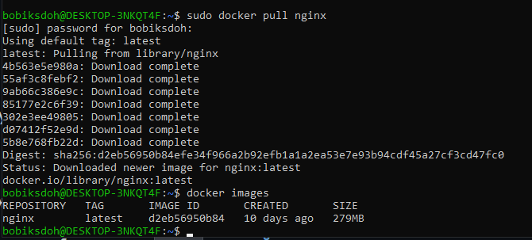
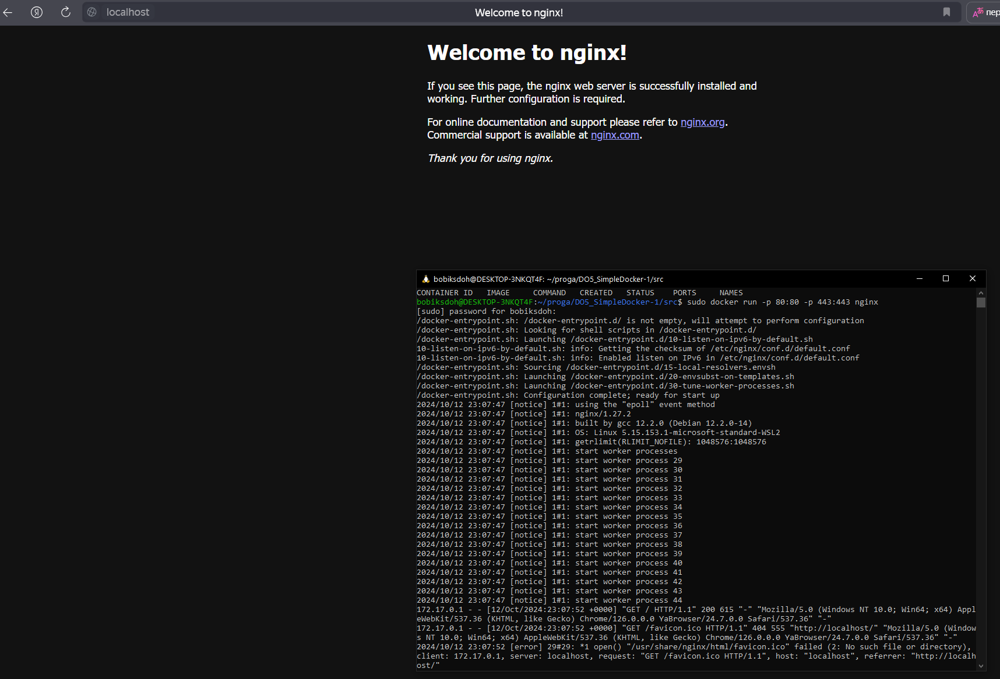
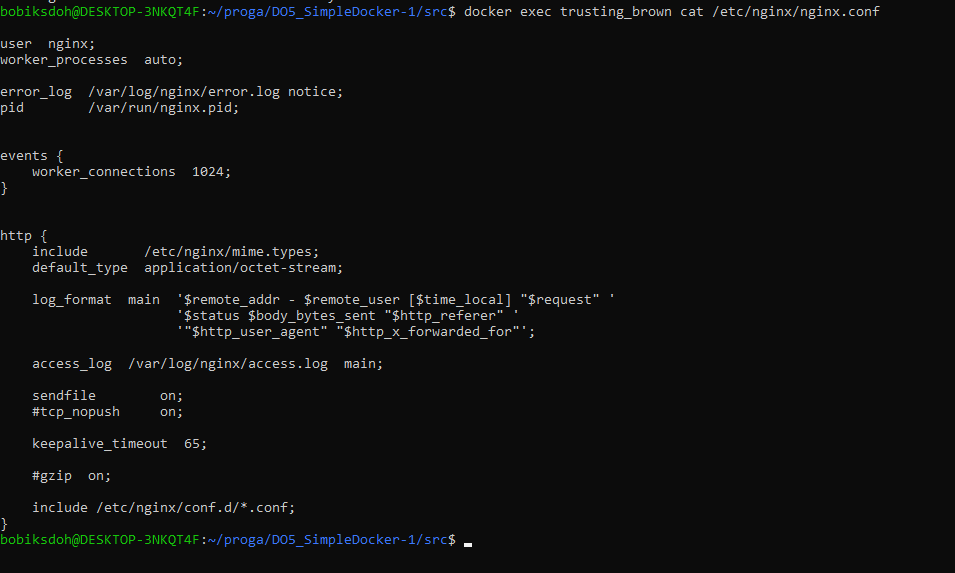
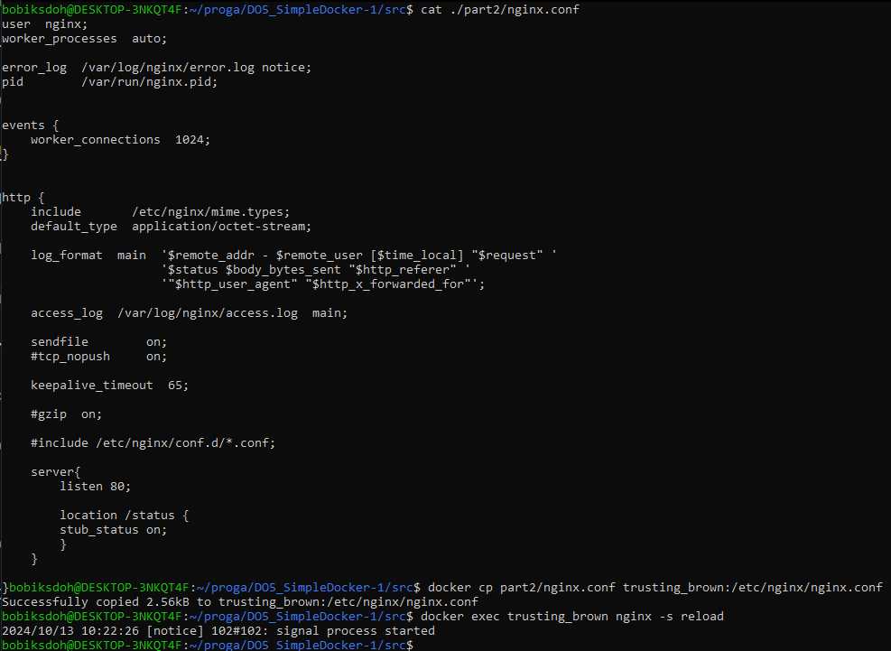
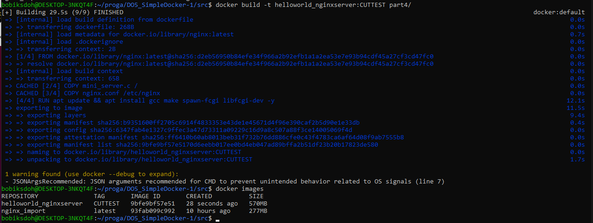
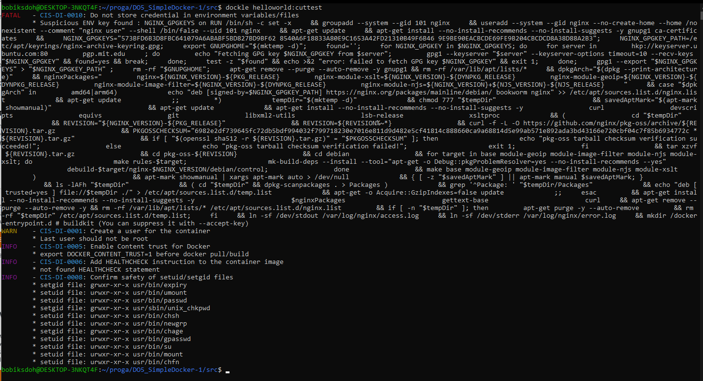
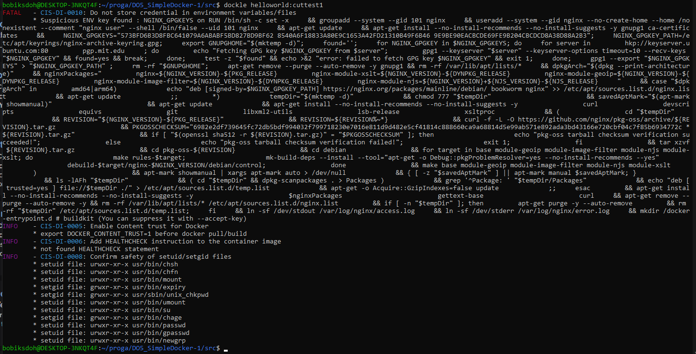

# Simple Docker

## Part 1. Готовый докер

### Возьми официальный докер-образ с **nginx** и выкачай его при помощи `docker pull`.

### Проверь наличие докер-образа через `docker images`.



### Запусти докер-образ через `docker run -d [image_id|repository]`.

### Проверь, что образ запустился через `docker ps`.


### Посмотри информацию о контейнере через `docker inspect [container_id|container_name]`.


### По выводу команды определи и помести в отчёт размер контейнера, список замапленных портов и ip контейнера.

мой контейнер с nginx называется **bobik_nomore_gavking** и в нём мы видим:

- Размер контейнера: `"SizeRw": 81920, "SizeRootFs": 206245888,`, где  SizeRw это rewritten size, а SizeRootFs значит размер образа

- Список запампленых портов:  "Ports": `{ "80/tcp": null },`

- ip контейнера: `"IPAddress": "172.17.0.2",`

### Останови докер контейнер через `docker stop [container_id|container_name]`.

### Проверь, что контейнер остановился через `docker ps`.


### Запусти докер с портами 80 и 443 в контейнере, замапленными на такие же порты на локальной машине, через команду *run*.

### Проверь, что в браузере по адресу *localhost:80* доступна стартовая страница **nginx**.



### Перезапусти докер контейнер через `docker restart [container_id|container_name]`.

### Проверь любым способом, что контейнер запустился.


## Part 2. Операции с контейнером

Докер-образ и контейнер готовы. Теперь можно покопаться в конфигурации **nginx** и отобразить статус страницы.

### Прочитай конфигурационный файл *nginx.conf* внутри докер контейнера через команду *exec*.



### Создай на локальной машине файл *nginx.conf*.

### Настрой в нем по пути */status* отдачу страницы статуса сервера **nginx**.

### Скопируй созданный файл *nginx.conf* внутрь докер-образа через команду `docker cp`.

### Перезапусти **nginx** внутри докер-образа через команду *exec*.



### Проверь, что по адресу *localhost:80/status* отдается страничка со статусом сервера **nginx**.


### Экспортируй контейнер в файл *container.tar* через команду *export*.

### Останови контейнер.


### Удали образ через `docker rmi [image_id|repository]`, не удаляя перед этим контейнеры.

### Удали остановленный контейнер.


### Импортируй контейнер обратно через команду *import*.

### Запусти импортированный контейнер.

### Проверь, что по адресу *localhost:80/status* отдается страничка со статусом сервера **nginx**.


## Part 3. Мини веб-сервер

### Напиши мини-сервер на **C** и **FastCgi**, который будет возвращать простейшую страничку с надписью `Hello World!`.

- по этому пункту обратился за помощью [cюда](../materials/mini_server_RUS.md)

### Запусти написанный мини-сервер через *spawn-fcgi* на порту 8080.

```bash
gcc mini_server.c -o helloworld -lfcgi

spawn-fcgi -p 8080 helloworld
```

### Напиши свой *nginx.conf*, который будет проксировать все запросы с 81 порта на *127.0.0.1:8080*.

- дописал в конфиг следующие строки

```bash
    server {
        listen 81;

        location / {
        fastcgi_pass 127.0.0.1:8080;
        include fastcgi_params;
        }
    }
```

### Проверь, что в браузере по *localhost:81* отдается написанная тобой страничка.


### Положи файл *nginx.conf* по пути *./nginx/nginx.conf* (это понадобится позже).

- хорошо.

## Part 4. Свой докер

### Напиши свой докер-образ, который:

#### 1) собирает исходники мини сервера на FastCgi из [Части 3](#part-3-мини-веб-сервер);

#### 2) запускает его на 8080 порту;

#### 3) копирует внутрь образа написанный *./nginx/nginx.conf*;

#### 4) запускает **nginx**.

_**nginx** можно установить внутрь докера самостоятельно, а можно воспользоваться готовым образом с **nginx**'ом, как базовым._

### Собери написанный докер-образ через `docker build` при этом указав имя и тег.

### Проверь через `docker images`, что все собралось корректно.



### Запусти собранный докер-образ с маппингом 81 порта на 80 на локальной машине и маппингом папки *./nginx* внутрь контейнера по адресу, где лежат конфигурационные файлы **nginx**'а (см. [Часть 2](#part-2-операции-с-контейнером)).

```docker run -d -p 80:81 -v "$(pwd)/nginx/nginx.conf:/etc/nginx/nginx.conf" helloworld:cuttest```

### Проверь, что по localhost:80 доступна страничка написанного мини сервера.


### Допиши в *./nginx/nginx.conf* проксирование странички */status*, по которой надо отдавать статус сервера **nginx**.

```bash
    server{
        listen 81;
        location / {
            fastcgi_pass 127.0.0.1:8080;
            include fastcgi_params;
        }        
        
        location /status {
            stub_status on;
        }
    }
```

### Перезапусти докер-образ.

*Если всё сделано верно, то, после сохранения файла и перезапуска контейнера, конфигурационный файл внутри докер-образа должен обновиться самостоятельно без лишних действий*.

### Проверь, что теперь по *localhost:80/status* отдается страничка со статусом **nginx**


## Part 5. **Dockle**

После написания образа никогда не будет лишним проверить его на безопасность.

**== Задание ==**

### Просканируй образ из предыдущего задания через `dockle [image_id|repository]`.



### Исправь образ так, чтобы при проверке через **dockle** не было ошибок и предупреждений.



p.s. 

## Part 6. Базовый **Docker Compose**

- Тут получается мне надо переделать прошлый контейнер, прописать в нём нэймсервер, чтобы он был типа на отдельной странице, не локал хост
- потом чё то ещё сделать и доделать хуйню эту в пизду

### Напиши файл *docker-compose.yml*, с помощью которого:

### 1) Подними докер-контейнер из [Части 5](#part-5-инструмент-dockle) _(он должен работать в локальной сети, т. е. не нужно использовать инструкцию **EXPOSE** и мапить порты на локальную машину)_.

### 2) Подними докер-контейнер с **nginx**, который будет проксировать все запросы с 8080 порта на 81 порт первого контейнера.

### Замапь 8080 порт второго контейнера на 80 порт локальной машины.

### Останови все запущенные контейнеры.

### Собери и запусти проект с помощью команд `docker-compose build` и `docker-compose up`.

### Проверь, что в браузере по *localhost:80* отдается написанная тобой страничка, как и ранее.


